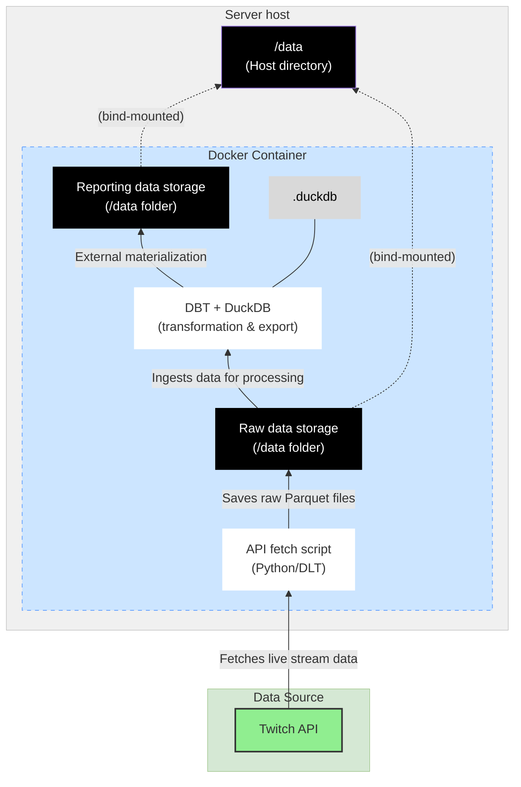
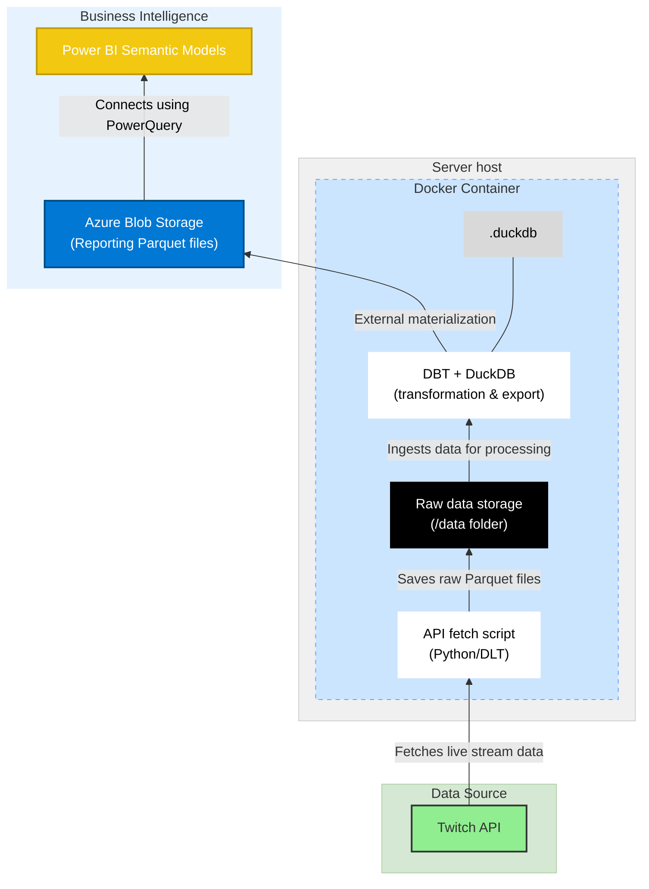

# ⚡ Overview

## Purpose
### Technical PoC
This project is a PoC for a modern, decoupled data processing pipeline using DuckDB and DBT. It transforms raw Twitch data from Parquet files into analysis-ready reporting tables, which are also saved in Parquet format. 

### PoC architecture
In the PoC version, the data is transformed and materialized externally, but still stored within the server:


### Target architecture
While the PoC uses a local folder `/data` for output files, the architecture could be compatible with a cloud environment like AWS S3, GCP, or Azure Blob Storage, allowing cloud BI tools to query the data directly. For instance, we can imagine to import the reporting Parquet files from Azure Blob Storage into a Power BI Semantic Model using PowerQuery:



The main benefits are :
- **Massive cost reduction**: cloud storage cost is close to zero, DuckDB and DBT are free, only pay for the VM compute time of the regular batches.
- **Decoupled and future-proof architecture**: the compute layer can be switched out without any migration effort. On the storage side, the Parquet file format is not locked into a proprietary format and a wide ecosystem of tools can read it directly.
- **Time-to-market and agility**: this project is extremely light and quick to deploy. It can even serve as an interim data lakehouse solution before scaling to a cloud datawarehouse like Snowflake or BigQuery. Since all the transformations are in DBT, the technical migration effort from DuckDB is marginal.

### Business case
We use the Twich API streams data to build the pipeline. The main goal is to construct summarized statistics of average viewer count per stream, per day and game played.
This project is mostly a technical PoC, but we could push the business case further to derive insights and answer questions such as "what games have more viewers on average and what is the distribution of viewers ?", i.e. "are there games with less viewers but more evenly distributed viewer count on smaller streams" ?

## Repository
This repository contains all the scripts aiming to: 
1. Call the Twitch API to get all currently live streams and save the results in a Parquet file under `/data/twitch_streams_pipeline`.
2. Run DBT on DuckDB to ingest, transform and store this raw data.
3. Output a transformed reporting table `fact_streams` under `/data`.

# 🛠️ Technical overview
## Tools
- Data extraction (API): **Python** (with [DLT - Data Load Tool library](https://dlthub.com))
- Data storage & compute: **DuckDB**
- Data transformation: **DBT**
- Documentation: **DBT Docs**
- Deployment: using **Docker Hub**
- Pipeline monitoring: [**Healthcheck.io**](https://healthchecks.io/)

## Requirements
- Python
- Docker
- Makefile

### Optional
- DuckDB CLI

## Commands
This project is fully dockerized and can be executed locally or deployed on a server.

### Local execution
...

### Virtual Private Server (VPS) deployment
Here is how to deploy the project on a VPS:
1. In an Ubuntu machine, create a new project: `mkdir ~/twitch_bi`.
2. Inside, create a `/data` folder: `mkdir data`.
3. Pull and run the docker image with a bind-mount the `/data` folder.
```bash
docker pull gabriellegall/twitch-bi:latest
docker run --rm -it -v "$(pwd)/data:/app/data" gabriellegall/twitch-bi:latest
```

# 📂 Project

## Data extraction
The script `twitch_streams.py` ingests real-time stream data from the Twitch API. Using the DLT library, it retrieves a **snapshot** of all active streams at the time of execution. The script navigates the API's paginated results using a cursor and persists the extracted data into a single Parquet file, which is stored in the `/data/twitch_streams_pipeline_dataset` directory. The Parquet file is suffixed with the execution time of the pipeline (i.e. the snapshot date).

## Staging data ingestion
Given raw input Parquet files made available in the `/data/twitch_streams_pipeline_dataset` folder, the DBT Python model `stg_streams.py` will load this data into DuckDB incrementally.
To do so, the script lists all file names in `/data/twitch_streams_pipeline_dataset` and compares them with the list of file names already imported. It then loads the missing files.

## Intermediate layer
Staging data is then ingested in the intermediate layer of DuckDB applying a deduplication on the stream ID since the real-time page cursor navigation can sometimes yield the same stream ID twice.

## Datawarehouse layer
Finally, the datawarehouse layer aggregates the stream data per date, user and game to calculate the average viewer count.
