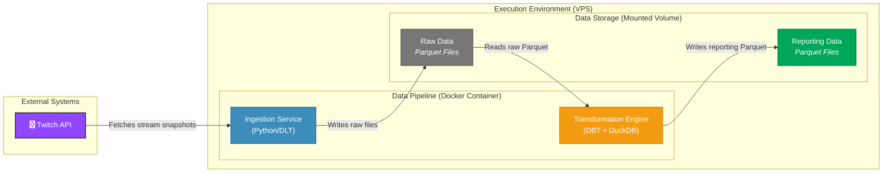
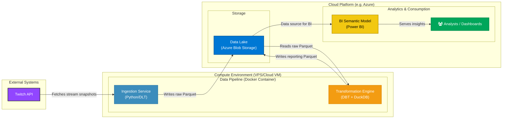

# ⚡ Overview

## Purpose
### Technical PoC
This project is a PoC for a modern, decoupled data processing pipeline using DuckDB and DBT. It transforms raw Twitch data from Parquet files into analysis-ready reporting tables, which are also saved in Parquet format. 

### PoC architecture
In the PoC version, the data is transformed and materialized externally, but still stored within the server:


### Target architecture
While the PoC uses a local folder `/data` for output files, the architecture could be compatible with a cloud environment like AWS S3, GCP, or Azure Blob Storage, allowing cloud BI tools to query the data directly. For instance, we can imagine importing the reporting Parquet files from Azure Blob Storage into a Power BI Semantic Model using PowerQuery:



The main benefits are :
- **Massive cost reduction**: cloud storage cost is close to zero, DuckDB and DBT are free, only pay for the VM compute time of the regular batches.
- **Decoupled and future-proof architecture**: the compute layer can be switched out without any migration effort. On the storage side, the Parquet file format is not locked into a proprietary format and a wide ecosystem of tools can read it directly.
- **Time-to-market and agility**: this project is extremely light and quick to deploy. It can even serve as an interim data lakehouse solution before scaling to a cloud datawarehouse like Snowflake or BigQuery. Since all the transformations are in DBT, the technical migration effort from DuckDB is marginal.

### Business case
We use the Twitch API streams data to build the pipeline. The main goal is to construct summarized statistics of average viewer count per stream, per day, and game played.
This project is mostly a technical PoC, but we could push the business case further to derive insights and answer questions such as "what games have more viewers on average, and what is the distribution of viewers?", i.e. "are there games with fewer viewers but more evenly distributed viewer count on smaller streams?" 

## Repository
This repository contains all the scripts intended to: 
1. Call the Twitch API to get all currently live streams and save the results in a Parquet file under `/data/twitch_streams_pipeline/twitch_streams`.
2. Run DBT on DuckDB to ingest, transform and store this raw data.
3. Output a transformed reporting table `fact_streams` under `/data/fact_streams.parquet`.

# 🛠️ Technical overview
## Tools
- Data extraction (API): **Python** (with [DLT - Data Load Tool library](https://dlthub.com))
- Data storage & compute: **DuckDB**
- Data transformation: **DBT**
- Documentation: **DBT Docs**
- Deployment: using **Docker Hub**
- Pipeline monitoring: [**Healthcheck.io**](https://healthchecks.io/)

## Requirements
- Python
- Docker

### Optional
- Makefile
- DuckDB CLI

## Commands
This project is fully dockerized and can be executed locally or deployed on a server.

### Project execution
Here is how to run the project:
1. Create a new project: `mkdir ~/twitch_bi`.
2. Inside, create a `/data` folder: `mkdir data`.
3. Pull, run the docker image with a bind-mount of the `/data` folder, and pass the API variables:
```bash
docker pull gabriellegall/twitch-bi:latest
docker run --rm -it -v "$(pwd)/data:/app/data" -e HEALTHCHECK_URL=https://hc-ping.com/xxx -e CLIENT_ID=xxx -e CLIENT_SECRET=xxx gabriellegall/twitch-bi:latest
```

# 📂 Project

## Layers

### Data extraction (Python)
The script `twitch_streams.py` ingests real-time stream data from the Twitch API. Using the DLT library, it retrieves a **snapshot** of all active streams at the time of execution. The script navigates the API's paginated results using a cursor and persists the extracted data into a single Parquet file, which is stored in the `/data/twitch_streams_pipeline_dataset/twitch_streams` directory. The Parquet file is suffixed with the execution time of the pipeline (i.e. the snapshot date).

### Staging data ingestion (DBT Python)
Given raw input Parquet files made available in the `/data/twitch_streams_pipeline_dataset/twitch_streams` folder, the DBT Python model `stg_streams.py` will load this data into DuckDB incrementally.
To do so, the script lists all file names in `/data/twitch_streams_pipeline_dataset/twitch_streams` and compares them with the list of file names already imported. It then loads the missing files.

### Intermediate layer (DBT SQL)
Staging data is then ingested in the intermediate layer of DuckDB applying a deduplication on the stream ID for each data snapshot since the real-time page cursor navigation can sometimes yield the same stream ID twice. This model incrementally updates based on the field [file_name_datetime].

### Datawarehouse layer (DBT SQL)
The `fact_streams.sql` model materializes the primary fact table in the aggregation layer. Its purpose is to compute the average viewer count by aggregating stream data at the composite key of date, user_id, and game_id.

The implementation is designed for high performance and scalability. It leverages an external materialization to write columnar Parquet files, which are physically organized using partitioning on the date field. The incremental logic dynamically identifies the latest partition in the target dataset and queries the source for all records from that date forward. DuckDB's `overwrite_or_ignore` option then ensures that only these targeted partitions are overwritten. This stateful refresh mechanism ensures that historical data is not re-processed on incremental loads.

## Documentation
Since DuckDB supports Python models, all transformations can be streamlined within DBT. This is also true for model documentation as models are documented in DBT via YAML files.

## Data quality and testing 
Since DuckDB supports Python models, the entire pipeline can be tested leveraging DBT tests. For instance, a DBT test `assert_incremental_load.sql` has been developed to ensure that all files are consistently integrated incrementally throughout the pipeline. 

## Orchestration
In the PoC, the pipeline was orchestrated in the VPS using an hourly cron job:
```
0 * * * * /usr/bin/docker pull gabriellegall/twitch-bi:latest && /usr/bin/docker run --rm -v /root/twitch_bi/data:/app/data -e HEALTHCHECK_URL=https://hc-ping.com/xxx -e CLIENT_ID=xxx -e CLIENT_SECRET=xxx gabriellegall/twitch-bi:latest
```

## Full reload
While DBT models run fast on incremental loads, the single-node processing of DuckDB can create bottlenecks when a full-refresh is necessary (e.g. rule updates on historical data, new fields calculated, etc.). To avoid memory limits, the `run.py` file contains the scenario 'dbt_iterative_reload' which can be managed via the `--scenario` argument and the start/end dates `--start_date` and `--end_date`. The script will sequentially execute DBT run for each individual day in the time range.

## Performance
The project was deployed on a Hetzner VPS for 2 weeks and fetched approximately 200K records every 1H. The project was running on a machine with 4GB of RAM running Ubuntu without any performance issues. A full reload using `run.py` was also performed successfully.
